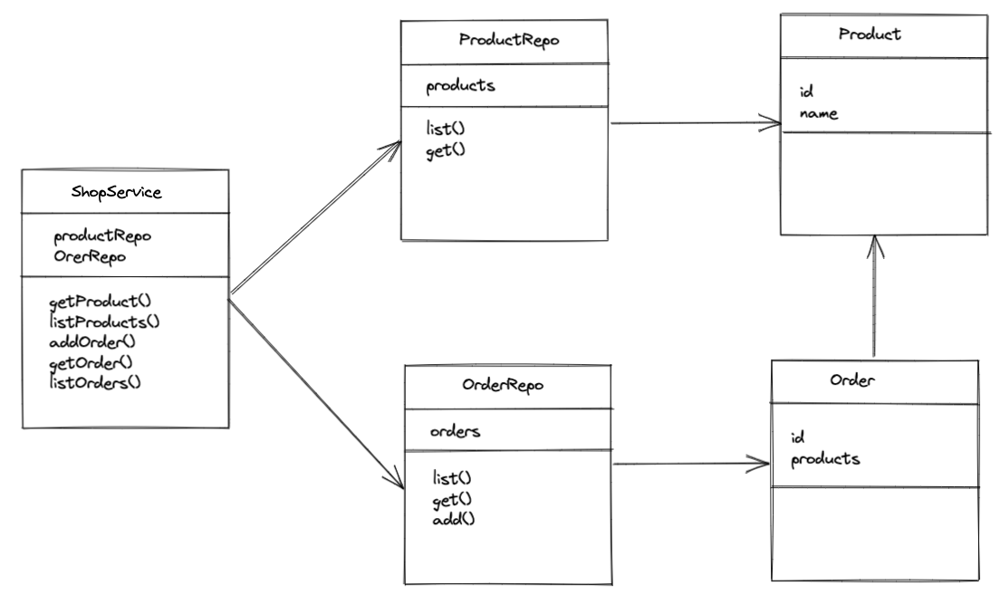

# Aufgabe: Bestellsystem

Der Auftraggeber wünscht sich einen Shop-Service, um seine Produkt-Bestellungen verwalten zu können.  
Er möchte auf der Konsole ausgeben lassen können:

-   ein einzelnes Produkt
-   alle Produkte

Zusätzlich kann er eine neue Bestellung aufgeben. Für jede neue Bestellung möchte er die entsprechenden Produkt-Ids  
mitangeben.  
Weiterhin möchte er:

-   sich eine einzelne Bestellung anhand ihrer id ausgeben lassen.
-   alle Bestellungen ausgeben lassen können.
# Aufgabe - Tipps

Implementiere das Bestellsystem (**natürlich mit Tests!**).

1.  Erstelle eine Klasse  `ProductRepo`, die eine  `Product`  Liste enthält.
2.  Erstelle eine Klasse  `OrderRepo`, die eine  `Order`  Liste enthält
3.  Erstelle eine Klasse  `ShopService`, über die wir eine neue  `Order`  aufgeben können.
4.  `throw`  eine Exception, wenn nicht-existente Produkte bestellt werden

# Aufgabe - Bonus

1.  Nutze anstelle einer  `Product`  Klasse ein Interface und implementiere verschiedene Ausführungen
2.  Nutze ENUM's um den Status der Bestellung anzuzeigen
3.  Versehe die Bestellungen noch mit einem Datum und einer Zeitangabe, überlege hierzu was du für ein Datentyp verwenden  
    solltest
4.  Schaue dir  `assertj`  an und nutze die assertj matchers in deinen Tests
5.  Schaue dir an wie  [Klassendiagramme](https://de.wikipedia.org/wiki/Klassendiagramm)  in UML entworfen werden.
6.  Nutze einen Optional für die get() Methoden

